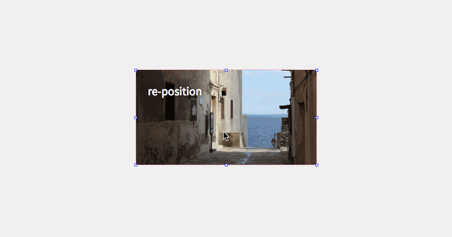

# re-position

Drag, resize, and rotate all in one flexible React component.

Due to the nature of how browsers do CSS transform calculations, combining
intuitive resize and rotation handles is harder than you would imagine
(matrix math anyone?). Let `re-position` do the hard work for you.

## Example Projects

* [Basic Typescript RepositionableContainer Example](https://codesandbox.io/s/wpkw5jyy7)
* Basic Javascript RepositionableContainer Example (TODO)
* Positionable Example (TODO)
